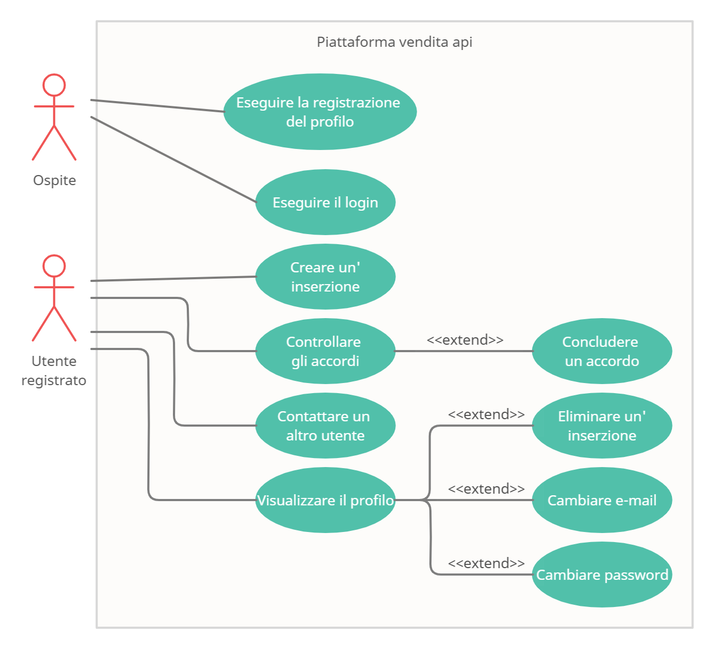
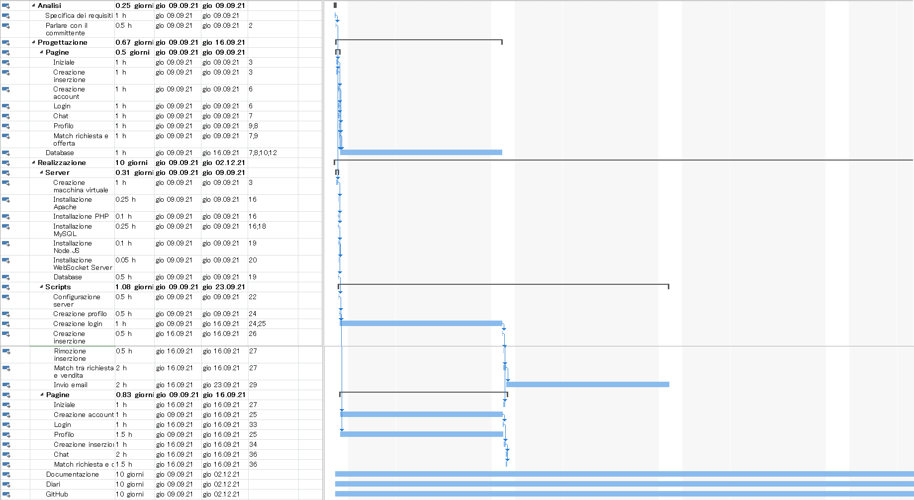
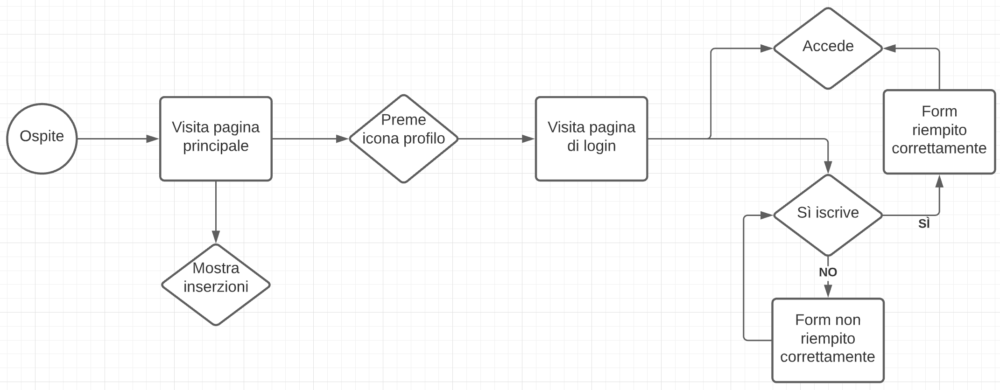
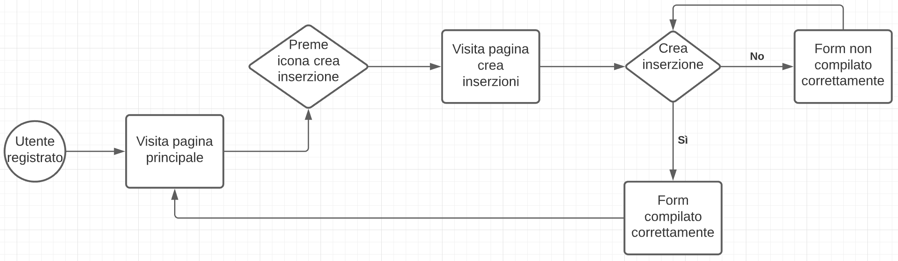
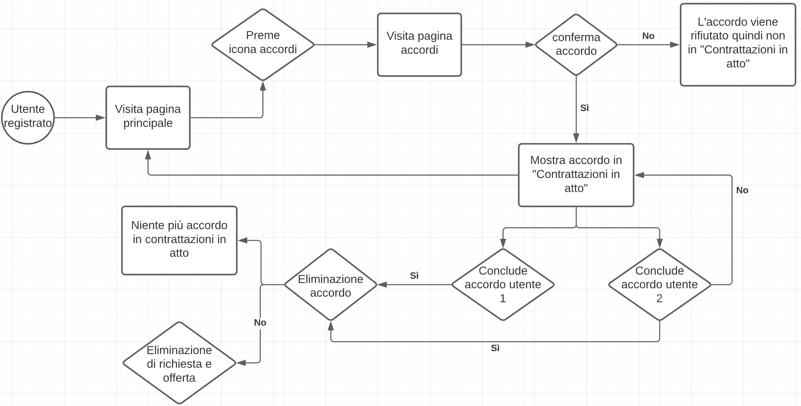
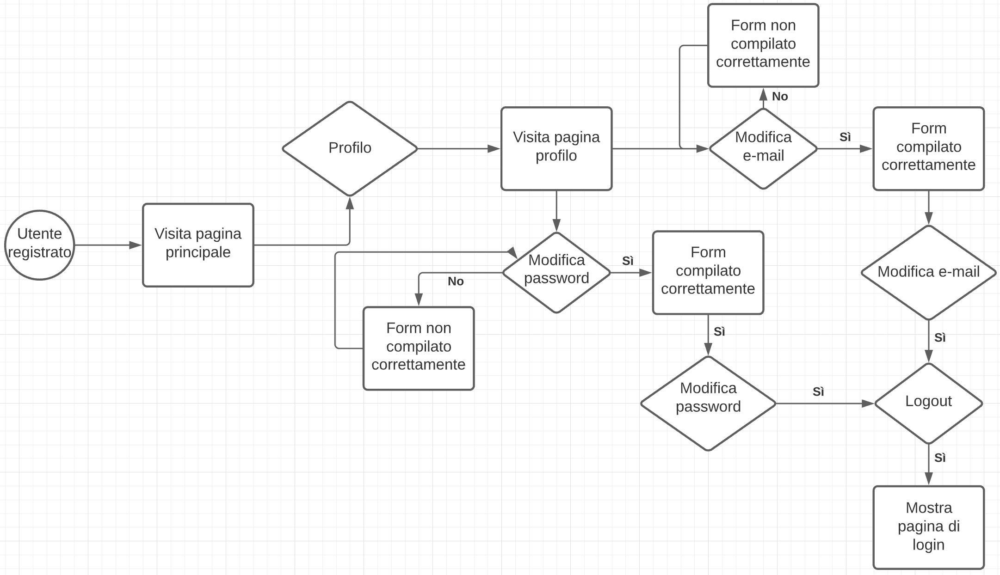
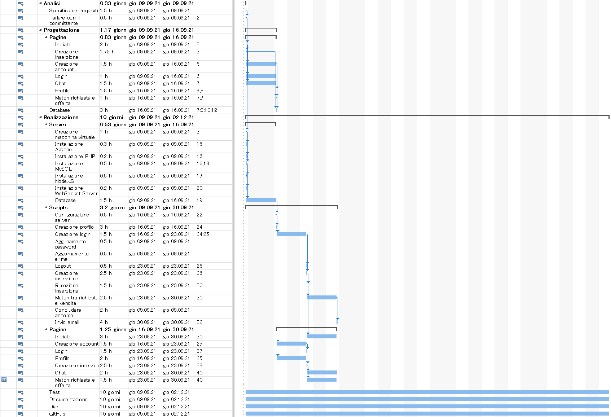

1. [Introduzione](#introduzione)

    - [Informazioni sul progetto](#informazioni-sul-progetto)

    - [Abstract](#abstract)

    - [Scopo](#scopo)

2. [Analisi](#analisi)

    - [Analisi del dominio](#analisi-del-dominio)
  
    - [Analisi dei mezzi](#analisi-dei-mezzi)

    - [Analisi e specifica dei requisiti](#analisi-e-specifica-dei-requisiti)

    - [Use case](#use-case)

    - [Pianificazione](#pianificazione)

3. [Progettazione](#progettazione)

    - [Design dell’architettura del sistema](#design-dell’architettura-del-sistema)

    - [Design dei dati e database](#design-dei-dati-e-database)

4. [Implementazione](#implementazione)

5. [Test](#test)

    - [Protocollo di test](#protocollo-di-test)

    - [Risultati test](#risultati-test)

    - [Mancanze/limitazioni conosciute](#mancanze/limitazioni-conosciute)

6. [Consuntivo](#consuntivo)

7. [Conclusioni](#conclusioni)

    - [Sviluppi futuri](#sviluppi-futuri)

    - [Considerazioni personali](#considerazioni-personali)

8. [Sitografia](#sitografia)

9. [Allegati](#allegati)

<div style="page-break-after: always;"></div>

## Introduzione

### Informazioni sul progetto

 - Allievo: Samuel Banfi

 - Committente: Luca Muggiasca

 - Classe I3BB, Scuola Arti e Mestieri Trevano, sezione Informatica.

 - Data d'inizio: 09.09.2021

 - Data di fine: 23.12.2021 

### Abstract

Al giorno d'oggi esistono molti siti per lo scambio e la vendita di prodotti tra privati. Ma questi sono limitati dal fatto che molte volte richiedenti 
e venditori non riescono a trovarsi per concludere l'affare. Infatti quando viene pubblicata una richiesta, un venditore non è a conoscenza del fatto che
è stato aggiunta una nuova richiesta. Deve andare a cercare da solo le richieste, azione che può essere molto oneroso in fattore di tempo. Una soluzione esiste,
ed è quella di informare richiedente e venditore, per email o tramite una chat, che c'è un utente sulla piattaforma che è disposto a vendere il prodotto
e un altro utente che è disposto a prenderlo. In questo modo si ha la possibilità di evitare i numerosi sprechi di tempo e così facendo si aumenta anche
la possibilità di vendere o trovare un prodotto.

### Scopo

 Lo scopo di questo progetto è di sviuppare una piattaforma web sulla quale si ha la possibilità di pubblicare delle richieste o delle offerte riguardanti le api
 dove gli utenti vengono informati quando la loro richiesta trova un offerta. Gli utenti vengono messi in contatto solamente se le loro richieste e le
 rispettive offerte si trovano all'interno dello stesso distretto e se le tipologie di richiesta e vendita corrispondono. Infatti ci sono tre tipi di
 prodotti che posssono essere venduti sulla piattaforma:

 - Famiglia di api
  
 - Nucleo di api

 - Ape regina

<div style="page-break-after: always;"></div>

## Analisi

### Analisi del dominio

 Attualmente in Svizzera non è ancora stato sviluppata una piattaforma web sulla quale si possa commerciare Api all'interno dello stesso distretto.
 Questo progetto nasce da una mancanza fondamentale, non esiste ancora un luogo comune dove gli apicoltori possano comunicare e commerciare le loro api.
 Questo progetto di fatto risolve questa lacuna, infatti è una piattaforma simile a [tutti.ch](https://www.tutti.ch/it) dove al posto degli oggetti comuni si possono commerciare
 esclusivamente api. È simile a tutti.ch ma questo progetto apporta un upgrade fondamentale alla piattaforma di commercio tra privati perché fino ad ora sulla piattaforma
 tutti.ch molti venditori e acquirenti non riescono a trovarsi e decidono di abbandonare la ricerca del prodotto o la vendita.
 Questo progetto lo migliora perché quando una richiesta trova un'offerta valida queste persone vengono informate via email.

 - Quale è e come è organizzato il contesto in cui il prodotto dovrà
   funzionare?

 - Come viene risolto attualmente il problema? Esiste già un prodotto
   simile?

 Attualmente questo progetto rappresenta un prodotto unico mai sviluppato in precendenza. Esistono prodotti simili ma non hanno le stesse funzionalità, per il motivo che trattano un mercato generico, la vendita tra privati di tutto. Mentre questo prodotto è unico nel suo genere perché permette agli apicoltori di avere una piattaforma specifica e prettamente dedicata al commercio delle api. Sul web questo progetto rappresenta l'unica piattaforma web per mettere in contatto gli apicoltori. Gli apicoltori secondo me hanno necessità di comunicare per poter commerciare le loro api, senza questa piattaforma è difficile riuscire a vendere le api, soprattutto su tutti.ch dove rappresentano una minoranza. Questa è una piattaforma destinata esclusivamente a degli apicoltori o a dei futuri apicolori, infatti la piattaforma segue le norme legali per quanto riguarda la vendità di api all'interno dello stesso distretto, altrimenti servirebbero dei permessi speciali. Di fatto questa piattaforma evita problemi legali sia a persone nuove del mestiere che a persone esperte ma magari non a conoscenza di alcune leggi sulla tutela delle api. Le persone che utilizzano questo prodotto variano dal principiante che si affaccia al mondo dell'apicoltura all'esperto che conosce questo mondo da molto tempo. Questa piattaforma è molto adatta ai neofiti proprio per il motivo che questo prodotto controlla il distretto dove viene richiesto un prodotto e mostra solo le offerte che corrispondo allo stesso distretto e allo stesso prodotto. Per utilizzare questo prodotto l'utente non deve possedere alcuna conoscenze riguardo le api e il commercio delle stesse. La piattaforma fornisce ai novizi una sezione con dei link per impare tutto quello che riguarda le api e il loro commercio, questo per permettere alle nuove persone di giostrarsi in modo efficace  all'interno di questo mercato per molti sconosciuto.

<div style="page-break-after: always;"></div>

### Analisi e specifica dei requisiti

 | **ID** | REQ-001 |
 | ------- | - |
 | **Nome** | Pagina principale |
 | **Priorità** | 1 |
 | **Versione** | 1.0 |
 | **Note** | Dovrà esserci una pagina principale dove saranno visibili tutte le inserzioni |

 | **ID** | REQ-002 |
 | ------- | - |
 | **Nome** | Pagina di iscrizione |
 | **Priorità** | 1 |
 | **Versione** | 1.0 |
 | **Note** | Dovra esserci una pagina di iscrizione con nome, cognome, nome utente, email, password e conferma password |

 | **ID** | REQ-003 |
 | ------- | - |
 | **Nome** | Pagina di login |
 | **Priorità** | 1 |
 | **Versione** | 1.0 |
 | **Note** | Dovrà esserci una pagina di login con nome utente e password |

 | **ID** | REQ-004 |
 | ------- | - |
 | **Nome** | Pagina di profilo |
 | **Priorità** | 1 |
 | **Versione** | 2.0 |
 | **Note** | Dovrà esserci una pagina di profilo dove potranno essere visualizzate le informazione personali come nome, cognome, nome utente. Si dovranno anche visualizzare le inserzioni create dall'utente con la possibilità di rimuoverle. Bisogna avere la possibilità di cambiare l'indirizzo e-mail e la password |

 | **ID** | REQ-005 |
 | ------- | - |
 | **Nome** | Pagina per la creazione di un'inserzione |
 | **Priorità** | 1 |
 | **Versione** | 1.0 |
 | **Note** | Dovrà esserci una pagina dove si potranno creare delle inserzioni. Bisogna chiedere il nome per l'inserzione, una descrizione di quello che si vuole o si offre, che prodotto si cerca o vende (Famiglia di api, Nucleo di api o Api regine) |

 <div style="page-break-after: always;"></div>

 | **ID** | REQ-006 |
 | ------- | - |
 | **Nome** | Pagina di match |
 | **Priorità** | 1 |
 | **Versione** | 1.0 |
 | **Note** | Dovrà esserci una pagina dove verranno mostrati i match tra le rechieste o le offerte fatte dall'utente con le altre persone che cercano o vendono quello specifico prodotto |

 | **ID** | REQ-007 |
 | ------- | - |
 | **Nome** | Match nello stesso distretto |
 | **Priorità** | 1 |
 | **Versione** | 1.0 |
 | **Note** | I match tra offerte e richieste dovranno essere fatte esclusivamente all'interno dello stesso distretto |

 | **ID** | REQ-008 |
 | ------- | - |
 | **Nome** | Controlli sulla password |
 | **Priorità** | 1 |
 | **Versione** | 1.0 |
 | **Note** | Dovranno esserci i seguenti controlli per la creazione della password: lunga >= 8 caratteri <= 30 caratteri, dovrà avere almeno 1 carattere maiuscolo, 1 minuscolo e 1 carattere speciale |

 | **ID** | REQ-009 |
 | ------- | - |
 | **Nome** | Filtri pagina principale |
 | **Priorità** | 1 |
 | **Versione** | 1.0 |
 | **Note** | Devono essere presenti dei filtri in base alla tipologia (richiesta, offerta), al prodotto (Famiglia di api, Nucleo di api o Api regine) e al distretto (Bellinzona, Blenio, Leventina, Locarno, Lugano, Mendrisio, Riviera, Vallemaggia) |

<div style="page-break-after: always;"></div>

 | **ID** | REQ-010 |
 | ------- | - |
 | **Nome** | Scambio tra utenti |
 | **Priorità** | 1 |
 | **Versione** | 1.0 |
 | **Note** | Durante il match acquirenti e venditori possono confermare lo scambio tramite due bottoni di conferma. Se entrambi confermano lo scambio l'inserzione viene rimossa automaticamente |

 | **ID** | REQ-011 (Extra) |
 | ------- | - |
 | **Nome** | Chat tra acquirente e venditore |
 | **Priorità** | 2 |
 | **Versione** | 2.0 |
 | **Note** | Se possibile dovrà essere presente una pagina, nella quale in base ai match si potrà parlare con l'acquirente o con il venditore del prodotto |

<br>
<br>
  
**Spiegazione elementi tabella dei requisiti:**

**ID**: identificativo univoco del requisito

**Nome**: breve descrizione del requisito

**Priorità**: indica l’importanza di un requisito nell’insieme del
progetto, definita assieme al committente.

**Versione**: indica la versione del requisito. Ogni modifica del
requisito avrà una versione aggiornata.

Sulla documentazione apparirà solamente l’ultima versione, mentre le
vecchie dovranno essere inserite nei diari.

**Note**: eventuali osservazioni importanti o riferimenti ad altri
requisiti.

<div style="page-break-after: always;"></div>

### Use case



<div style="page-break-after: always;"></div>

### Pianificazione



<div style="page-break-after: always;"></div>

### Analisi dei mezzi

#### Mezzi a disposizione

 - VirtualBox 6.10 (x64)
 - Apache: 2.4.51 (x64)
 - PHP: 7.4.24 (Thread-Safe)
 - MySQL (Community Server): 8.0.26 (x64)
 - NodeJs: 14.18.1
 - HMailServer: 5.6.7

#### Librerie e tools utilizzati

 1. Npm: 6.14.15
 2. Composer: 2.1.12
 3. PHPMailer: 6.5.3
 4. Ws: 8.3.0
 5. MySQL: 2.18.1

#### Hardware disponibile per il progetto

 Macchina virtuale:
 - Sistema operativo: Windows 10 Pro
 - RAM: 4 GB
 - Archiviazione: 50 GB
 - Scheda di rete: Broadcom NetXtreme Gigabit Ethernet

In particolare le limitazioni di questo hardware sono:
 - Poca memoria RAM (Sistema abbastanza lento)
 - Poco spazio di archiviazione disponibile
 - Un solo core per il processore

<div style="page-break-after: always;"></div>

## Progettazione

### Design dell’architettura del sistema


<div style="page-break-after: always;"></div>

### Design dei dati e database

``` sql

CREATE TABLE utente
(
    id INT PRIMARY KEY AUTO_INCREMENT,
    nome VARCHAR(25) NOT NULL,
    cognome VARCHAR(25) NOT NULL,
    nome_utente VARCHAR(25) NOT NULL,
    email VARCHAR(50) NOT NULL,
    codice VARCHAR(60) NOT NULL
);

```

Ho scelto di creare la tabella utente con i campi id, nome, cognome, nome utente, email e codice perché nome e cognome
mi servono per identificare la persona, utile nel profilo e anche per l'icona. Il campo nome utente l'ho scelto per permettere
all'utente di fare login, di conseguenza ho implementato il campo codice. Il campo codice è di lunghezza 60 caratteri perché corrisponde
all'hash della password creato con il metodo di PHP [`password_hash()`](https://www.php.net/manual/en/function.password-hash.php) fornendo
come parametro `PASSWORD_DEFAULT` che crypta la password con l'algoritmo bcrypt che crea una stringa di 60 caratteri. L'hash della password
cambia ogni volta che si richiama il metodo. Infine ho creato il campo email per permettere al sito di inviare le email sulle nuove offerte
ai clienti che nelle richieste hanno fornito gli stessi parametri di ricerca (tipo e distretto).
La email e il codice possono essere cambiate dalle impostazioni del profilo dell'utente.

``` sql

CREATE TABLE prodotto
(
    id INT PRIMARY KEY AUTO_INCREMENT,
    nome VARCHAR(25)
);

CREATE TABLE distretto
(
    id INT PRIMARY KEY AUTO_INCREMENT,
    nome VARCHAR(25)
);

```

La tabella prodotto serve per definire la tipologia di prodotto che si vuole vendere: le tre tipologie di prodotti vendibili e acquistabili
sono: famiglia di api, nucleo di api e ape regina. Ho deciso di creare la tabella prodotto per evitare che un utente sbagli il nome del prodotto.
La tabella distretto serve per definire il distretto nel quale si trovano le api: i distretti sono: Locarnese, Bellinzonese, Blenio, Leventina, Riviera, 
Vallemaggia, Luganese e Mendrisiotto. Ho deciso di creare la tabella distretto per evitare che un utente sbagli il nome del distretto dove vuole
vendere o acquistare il suo prodotto.

<br>
<br>

``` sql

CREATE TABLE vendita
(
    id INT PRIMARY KEY AUTO_INCREMENT,
    nome VARCHAR(50) NOT NULL,
    descrizione TEXT,
    immagine MEDIUMBLOB NOT NULL,
    utente_id INT NOT NULL,
    prodotto_id INT NOT NULL,
    distretto_id INT NOT NULL,
    FOREIGN KEY(utente_id) REFERENCES utente(id),
    FOREIGN KEY(prodotto_id) REFERENCES prodotto(id),
    FOREIGN KEY(distretto_id) REFERENCES distretto(id)
);

```

La tabella vendità serve per inserire i dati dell'inserzione per poi confrontarle con le richieste. In questa tabella bisogna avere il titolo
dell'inserzione, ovvero il campo nome. In seguito c'è la descrizione di quello che vende l'utente, un'immagine come anteprima di quello che riceverà
il compratore. In seguito bisogna avere l'id dell'utente, l'id del prodotto e l'id del distretto. Questi ultimi tre campi sono riferimenti alla
tabella utente, prodotto e distretto. Nel caso in cui un utente, un prodotto o un distretto viene eliminato l'inserzione viene rimossa tramite
l'`ON DELETE CASCADE` di mysql che nel caso in cui uno dei riferimenti viene eliminato, si elimina tutto a cascata, quindi vengono rimosse 
tutte le righe che hanno come riferimento almeno uno dei tre campi `FOREIGN KEY`. Tutti i campi sono `NOT NULL` tranne la descrizione che non è indispensabile.

<div style="page-break-after: always;"></div>

``` sql

CREATE TABLE richiesta
(
    id INT PRIMARY KEY AUTO_INCREMENT,
    nome VARCHAR(50) NOT NULL,
    descrizione TEXT,
    immagine MEDIUMBLOB NOT NULL,
    utente_id INT NOT NULL,
    prodotto_id INT NOT NULL,
    distretto_id INT NOT NULL,
    FOREIGN KEY(utente_id) REFERENCES utente(id),
    FOREIGN KEY(prodotto_id) REFERENCES prodotto(id),
    FOREIGN KEY(distretto_id) REFERENCES distretto(id)
);

```

La tabella richiesta serve per inserire i dati dell'inserzione per poi confrontarle con le vendite. In questa tabella bisogna avere il titolo dell'inserzione, ovvero il campo nome. In seguito c'è la descrizione di quello che cerca l'utente di tipo `TEXT` per salvare fino a ~ 64 kB, un'immagine di tipo `MEDIUMBLOB` per salvare i dati (fino 2^24 - 1 bytes) come anteprima di quello che vuole il compratore. In seguito bisogna avere l'id dell'utente, l'id del prodotto e l'id del distretto. Questi ultimi tre campi sono riferimenti alla tabella utente, prodotto e distretto. Nel caso in cui un utente, un prodotto o un distretto viene eliminato l'inserzione viene rimossa tramite l'`ON DELETE CASCADE` di mysql che nel caso in cui uno dei riferimenti viene eliminato, si elimina tutto a cascata, quindi vengono rimosse tutte le righe che hanno come riferimento almeno uno dei tre campi `FOREIGN KEY`. Tutti i campi sono `NOT NULL` tranne la descrizione che non è indispensabile.

<div style="page-break-after: always;"></div>

``` sql

CREATE TABLE richiesta_vendita
(
    id INT PRIMARY KEY AUTO_INCREMENT,
    data_contratto DATE,
    vendita_id INT,
    richiesta_id INT,
    venditore_id INT,
    acquirente_id INT,
    concluso_venditore TINYINT(1) DEFAULT 0,
    concluso_acquirente TINYINT(1) DEFAULT 0,
    FOREIGN KEY(vendita_id) REFERENCES vendita(id)
        ON DELETE CASCADE
        ON UPDATE CASCADE,
    FOREIGN KEY(richiesta_id) REFERENCES richiesta(id)
        ON DELETE CASCADE
        ON UPDATE CASCADE,
    FOREIGN KEY(venditore_id) REFERENCES utente(id)
        ON DELETE CASCADE
        ON UPDATE CASCADE,
    FOREIGN KEY(acquirente_id) REFERENCES utente(id)
        ON DELETE CASCADE
        ON UPDATE CASCADE
);

```

La tabella richiesta_vendita serve per mettere in contatto compratore e venditore oltre a concludere gli accordi. Per concludere un accordo i campi concluso_venditore e concluso_acquirente devono essere entrambi a 1. Concluso_venditore e concluso_acquirente sono di tipo `TINYINT(1)` per definirli come se fossere dei campi booleani visto che il tipo di dato `boolean` in mysql non esiste. Nel caso in cui una vendita, una richiesta o un utente dovessere essere eliminato, la riga viene eliminata automaticamente dal database. Il campo data_contratto serve per sapere da quanto tempo due utenti stanno contrattando.

<div style="page-break-after: always;"></div>

``` sql

CREATE TABLE messaggi
(
    id INT PRIMARY KEY AUTO_INCREMENT,
    committente_id INT,
    destinatario_id INT,
    messaggio TEXT,
    FOREIGN KEY(committente_id) REFERENCES utente(id)
        ON DELETE CASCADE
        ON UPDATE CASCADE,
    FOREIGN KEY(destinatario_id) REFERENCES utente(id)
        ON DELETE CASCADE
        ON UPDATE CASCADE
);

```

La tabella messaggi permette di salvare tutti i messaggi inviati tra il compratore e il venditore riguardo ad un possibile accordo. Il campo committente_id serve per identificare la persona che ha inviato il messaggio, mentre il campo destinatario serve per conoscere chi è iol destinatario del messaggio. Il campo messaggio è di tipo `TEXT` per poter salvare fino a 65535 caratteri. Se il committente o il destinatario dovesse essere eliminato, tutti i loro messaggi vengono eliminati in automatico.

<div style="page-break-after: always;"></div>

### Schema E-R, schema logico e descrizione

#### Schema E-R


#### Schema logico

utente (<ins>id</ins>, nome, cognome, nome_utente, email, codice)<br>
prodotto (<ins>id</ins>, nome)<br>
distretto (<ins>id</ins>, nome)<br>
vendita (<ins>id</ins>, nome, descrizione *, immagine, utente_id (FK), prodotto_id (FK), distretto_id (FK))<br>
richiesta (<ins>id</ins>, nome, descrizione, immagine, utente_id (FK), prodotto_id (FK), distretto_id (FK))<br>
richiesta_vendita (<ins>id</ins>, data_contratto, concluso_venditore, concluso_acquirente, vendita_id (FK), richiesta_id (FK), venditore_id (FK), acquirente_id (FK))<br>
messaggi (<ins>id</ins>, committente_id (FK), destinatario_id (FK), messaggio)

<div style="page-break-after: always;"></div>

### Design delle interfacce


#### Pagina principale

La pagina principale permette a chiunque di vedere le inserzioni pubblicate dagli utenti. Un ospite può registrarsi per poter creare richieste, offerte guardare il suo profilo e può instaurare un dialogo con gli altri utenti del servizio. Gli utenti possono comunicare per email oppure tramite la chat integrata nel sito dove si comunica circa la richiesta e l'offerta. Per poter accedere alle pagine di aggiunta delle inserszioni, chat e il match l'utente deve eseguire il [login](#pagina-di-login) premendo l'icona rappresentante una persona. Se l'utente non ha ancora un profilo può [iscriversi](#pagina-di-registrazione) premendo il pulsante iscriviti. L'utente, nella pagina principale, può decidere di filtrare i risultati utilizzando due criteri:
 - Tipi di prodotto: Famiglia di api, Nucleo di api e Api regine
 - Distretti: Locarnese, Bellinzonese, Blenio, Leventina, Riviera, Vallemaggia, Luganese e Mendrisiotto


#### Pagina di registrazione

La pagina di registrazione permette all'utente di creare un nuovo profilo. Bisogna fornire il nome, il cognome, il nome utente, l'e-mail, la password e la conferma della password.
Tutti i campi compilabili sono obbligatori e se non vengono riempiti compare il mesaggio "Compilare tutti i campi per continuare".
La password è complessa e se la password non soddisfa i requisiti minimi compare il messaggio "La password non soddisfa i requisiti minimi di sicurezza".
Se la password inserita non corrisponde alla password di verifica compare il messaggio "La due password non corrispondono".
Nel caso in cui un utente abbia già un profilo utente è presente il collegamento alla pagina principale con il link "Accedi" accanto ad "Hai gia un account?".

<div style="page-break-after: always;"></div>


#### Pagina di login

La pagina di login permette all'utente di collegarsi con il suo profilo utente.<br> 
Se l'utente inserisce il nome utente oppure la password sbagliata viene mostrato il messaggio "Nome utente o password non corretti". Se il login viene effettuato correttamente l'utente viene reindirizzato alla pagina principale.

<div style="page-break-after: always;"></div>


#### Pagina di profilo

Nella pagina di profilo l'utente può visualizzare le sue informazioni personali, può cambiare l'indirizzo E-Mail inserendo l'email corrente e quella nuova, può cambiare la password inserendo quella corrente e quella nuova e può vedere le sue inserzioni per eliminarle. Quando l'utente accdede alla pagina di profilo viene visualizzato il messaggio "Benvenuto, \<nome> \<cognome>". Quando viene cambiata l'email o la password l'utente viene reindirizzato alla pagina di login.

<div style="page-break-after: always;"></div>


#### Pagina di creazione di un'inserzione

Nella pagina di creazione di una nuova inserzione l'utente può creare una nuova offerta oppure una nuova richiesta. Bisogna fornire un'immagine del prodotto (sià che si cerca o si vende) che può essere solo di tipo jpg, jpg o png. Poi serve un nome significativo, una descrizione del prodotto (La grandezza dell'area di testo può essere espansa), il prodotto (famiglia di api, nucleo di api, ape regina), il distretto (per poi mostrare solo le inserzione nello stesso distretto) e la tipologia che può essere o richiesta o offerta. In questo modo gli utenti avranno una visione chiara del prodotto. Le sezioni prodotto, distretto e tipologia possono essere selezionati tramite l'apposito menu dropdown e se un utente scrive qualcosa che non è presente nelle possibilità, viene impostato di default la prima scelta.

<div style="page-break-after: always;"></div>


#### Pagina di match

La pagina di match permette ad un utente registrato di vedere le **possibili** combinazioni tra la loro richiesta e le offerte disponibili grazie al servizio. Un utente può decidere se accettare o rifiutare un'offerta / richiesta tramite i due bottoni "Confermare" o "Rifiutare". Se il match viene confermato, all'interno della sezione [chat](#pagina-della-chat) del sito apparirà l'utente dell'inserzione e verrà mostrato all'interno della pagina match, nella sezione "Contrattazioni in atto".


#### Pagina della chat

La pagina della chat permette ad acquirenti e venditori di aver un dialogo circa il prodotto in offerta o il prodotto ricercato. Quando l'affare è concluso la chat viene eliminata in automatico.

<div style="page-break-after: always;"></div>

### Design procedurale



<br>
<br>
<br>



<br>
<br>
<br>



<br>
<br>
<br>



<div style="page-break-after: always;"></div>

## Implementazione


<div style="page-break-after: always;"></div>

### Pagina index

Durante la fase di sviluppo della [pagina iniziale](../src/index.php) ho deciso di mantenere lo stile simile a quello avevo sviluppato nella progettazione. Ho deciso di rimuovere il nome utente e la data delle inserzioni perché non le ritenevo più così fondamentali, essendoci la pagina per gli accordi che mi permetteva poi di mettermi in contatto con un'altro utilizzatore del sito tramite la chat integrata oppure tramite email Proseguendo con lo sviluppo mi sono reso conto che nei filtri mancavano delle scelte che potevano risultare molto utili, quindi rispetto alla progettazione ho deciso di aggiungere il filtro sulle offerte e sulle richiesta. Ho deciso di aggiungerli perché in questo modo anche le persone senza un profilo sono a conoscenza delle persone che offrono o cercano un prodotto. Per mostrare e nascondere le inserzioni in base ai filtri ho utilizzato javascript, con il metodo `swapState(<filterName, <pos>, <checkbox>)` che in base alla classe cambia lo stato da `display=''` a `display='none'` e viceversa. 

``` javascript

function swapState(filterName, pos, checkbox) {
    for (var i = 0; i < offers.length; i++) {
        if (offers[i].className.split(" ")[pos] == filterName) {
            if (checkbox.checked)
                offers[i].style.display="";
            else
                offers[i].style.display="none";
        }
    }
}

```

Per aggiungere l'[header](../src/Models/header.php) nella pagina ho creato un modello che richiamo dall'html con il comando `<?php require '<path>'?>`. Ho utilizzato la sessa procedura anche per le inserzione, con la funzione `require` di php posso utilizzare le funzioni della mia libreria per le inserzioni [insertion.php](../src/Models/insertion.php). Tramite il metodo `createInsertion(<product id>, <district>, <type>, <image>, <name>, <description>)`. Quando viene istanziato l'header può essere diverso in base al fatto se il visitatore ha eseguito il login oppure no. Infatti se `SESSION['id']` non è impostato tutti i link dell'header riportano a [`signin.html`](../src/signin.html)


<div style="page-break-after: always;"></div>

### Pagina di registrazione

Quando ho progettato la pagina per la registrazione dell'utente non avevo pensato al fatto che era più comodo avere un campo email da inserire perché credevo di metterla nella pagina di creazione di un'inserzione mentre durante lo sviluppo mi sono reso conto che le persone normalmente utilizzano la stessa e-mail per pubblicare un inserzione, non la cambiano ma mantengono sempre la stessa. Quindi ho deciso di modificare la struttura del database e all'interno della tabella utente ho aggiunto il campo `email VARCHAR(50) NOT NULL` per evitare che l'utente non inserisca nulla nel campo email. Per controllare la password ho deciso di usare l'input `email` che fa già dei controlli sulla password tramite  una regular expression con un pattern molto semplice. Per evitare i problemi di non compilazione dei campi ho deciso di aggiungere `required`
agli input HTML presenti nel form di registrazione. Il design della pagina è molto simile a quello che mi ero prefissato nella progettazione. Ho cambiato solamente il nome del titolo della pagina e di alcuni campi per renderlo più comprensibile all'utilizzatore del sito web. Per quanto riguarda i controlli di sicurezza sulla password, per evitare problemi di modifica dei criteri da parte degli utenti ho messo tutti i controlli lato server. Infatti se avessi usato javascript un utente malintenzionato avrebbe potuto cambiare i criteri di sicurezza e avrebbe inserito all'interno del database una password non sicura. Quando si preme il bottone "Iscrivii" tutti i dati vengono inviati in POST al server e viene richiamato lo script per la [creazione di un utente](../src/Server/Scripts/create_db_offer.php). Questo script mi permette di controllare se le password sono uguali, se soddisfa i requisiti minimi di sicurezza (REQ-008). Se i dati inseriti sono corretti si viene reindirizzati alla pagina di login e l'utente riceve l'email con all'interno "Benevuto nella comunity di venditori e compratori di api".

<div style="page-break-after: always;"></div>


### Pagina di login

La pagina di login è una pagina molto semplice che ho riprodotto esattamente come la progettazione. Non ho avuto molti controlli da fare in questa pagina, se non il controllo dell'inserimento dei campi. Se l'utente prova a inviare il form senza aver compilato tutti i campi, interviene il `required` che impedisce l'invio del form è indica all'utente i campi mancanti da compilare. Quando viene cliccato il pulsante `accedi` viene richiamato lo script [`login.php`](../src/Server/Scripts/login.php) dove viene selezionato l'utente inserito tramite una query. controllato se l'hash della password usata per fare il login corrisponde all'hash della password presente nel database. Se il login viene effettuato con successo vengono impostate le variabili di sessione `id`, `username` e `image`(per il logo nell'index) e si viene rimandati alla pagina principale, altrimenti si viene rimandati alla pagina di login per riprovare. Lo script per il login esegue una query per prendere la password relativa al nome utente inserito, se è corretto crea l'hash della password (inviata al server con il metodo `POST`) e tramite il metodo password_verifiy controlla se l'hash della password corrisponde all'hash presente nel database.


<div style="page-break-after: always;"></div>

### Pagina di profilo

Rispetto a come credevo di creare la pagina con la progetttazione ci sono state molte modifiche. Mi sono reso conto che in questo modo l'utente non aveva la possibilità di fare il logout dal suo profilo senza chiudere il browser. Per questo ho deciso di implementare un pulsante esci. Questo pulsante l'ho inserito all'interno di un form e quando viene premuto, il form richiama lo script [`logout.php`](../src/Server Scripts/logout.php) che contiene il reset delle variabili di sessione.<br>
Per resettare queste variabili ho utilizzato tre comandi di PHP:

 - `session_start();`: viene richiamato per poter accedere alle variabili di sessione che si posso utilizzare con il comando `$_SESSION["<nome>"]`.
 - `session_unset();`: serve per eliminare le variabili di sessione ma la sessione esiste ancora.
 - `session_destroy();`: serve per eliminare definitivamente la sessione.

In seguito ho aggiunto anche la possibilità di modificare sia e-mail che della password. Entrambi i form per le modifiche funzionano allo stesso modo:
 1. Bisogna compilare tutti i campi altrimenti si viene avvisati dell'errore.
 2. I valori dei due campi compilati non possono essere uguali.
 3. La nuova password o e-mail non deve corrispondere alla vecchia.
 4. La password deve soddisfare i criteri di sicurezza minimi e l'e-mail deve soddisfare il pattern standard.

Poi sempre tramite php ho aggiunto la possibilità di vedere le informazioni personali dell'utente collegato in quel momento. Come informazioni personali ho mostrato tutti i campi presenti nella tabella utente del database. Quindi le seguenti informazioni: nome, cognome, nome utente e email. In aggiunta alle inserzioni dell'utente ho aggiunto una suddivisione per rendere il tutto più ordinato. La prima suddivisione mi permette di vedere le mie offerte, mentre la seconda sezione mi permette di vedere le mie richieste.


<div style="page-break-after: always;"></div>

### Pagina di match

Nella pagina di match mi sono accorto che mancava un punto fondamentale, la conclusione di un accordo. In tal modo se i due utenti sono arrivati ad un accordo possono confermare la conclusione del loro accordo. Quando entrambi gli utenti sono d'accordo sulla conclusione dell'accordo l'inserzione dell'offerta e della richiesta vengono eliminate in automatico per evitare che altre persone cercano di entrare in contatto con un utente che ha già concluso un accordo. I possibili accordi vengono gestiti mostrando ad ogni ciclo tutte le offerte correlate in base alle richiesta. Per aggiungere un accordo alla lista delle contrattazioni bisogna premere il pulsante conferma, che richiama lo script confirm_or_reject_offer.php nel quale viene controllato se è stato premuto il pulsante confirma o rifiuta. Se viene confermata allora viene aggiunta alla tabella richiesta_vendita nel database i riferimenti alla due inserzioni, agli utenti e quando è cominciata la contrattazione.

```php

$requests = $conn->query("SELECT * FROM richiesta WHERE utente_id=" . $_SESSION['id']);
while ($request = $requests->fetch_assoc()) {
    echo <h2>richiesta...</h2>;
    $offers = $conn->query("SELECT * FROM vendita WHERE prodotto_id=" . $req["prodotto_id"] . "AND distretto_id=" . $req["distretto_id"]);
    while ($offer = $offers->fetch_assoc()) {
        createInsertion(...);
    }
}

```

<div style="page-break-after: always;"></div>

### Pagina della chat

Durante lo sviluppo della chat ho dovuto cambiare il linguaggio di programmazione e sono passato a `NodeJS`. Ho deciso di utilizzare node perché tramite delle librerie mi permette di avere una trasmissione in tempo reale tra tutti i client connessi e il server. Per avere una chat in tempo reale, sul server ho installato la libreria `ws` nonche il WebSocket che permette un collegamento in tempo reale con tutti. La libreria `ws` comprende dei metodi per inviare i dati che riceve il server a tutti gli altri client connessi. Per inviare i dati al server il client deve istanziare un oggetto `WebSocket` specificando l'indirizzo ip e la porta di ascolto del server. l'oggetto `WebSocket` contiene il metodo `send(<data>)` per inviare i dati al server. Il problema è che quando il server invia i dati a tutti i client, arrivano sotto forma di byte, quindi bisogna convertire tutti i byte in stringa per ottenere il messaggio inviato al server.

Server:

``` js

wss.on("connection", ws => {
    ws.on("message", data => {
        wss.clients.forEach(client => {
            client.send(data);
        });
    });
});

```

Client:

``` js

const ws = new WebSocket("ws://localhost:8080");

ws.send(msg);

ws.addEventListener("message", e => {
    var message = "";
    
    for (var i = 0; i < datas.length; i++) {
        message += String.fromCharCode(datas[i]);
    }
});

```

<div style="page-break-after: always;"></div>

## Test

### Protocollo di test


 | Test Case       | TC-001                               |
 | --------------- |--------------------------------------|
 | **Nome**        | Verifica della creazione di un profilo utente |
 | **Riferimento** | REQ-002 |
 | **Descrizione** | Sarà necessario verificare che la registrazione funzioni correttamente. A registrazione completata l'utente riceve una e-mail della conferma di creazione. |
 | **Prerequisiti** | - |
 | **Procedura** | 1. Aprire con un browser qualsiasi l'indirizzo http://www.beecommerce.com oppure http://localhost<br> 2. Premere l'icona della foto profilo<br> 3. Premere iscriviti<br> 4. Riempire il form con ad esempio "Giulio", "Cairoli", "giulio.cairoli", "giulio.cairoli@gmail.com", "Abc1234!", "Abc1234!"<br> 5. Premere "Iscriviti" (sì verrà reindirizzati alla pagina di login) |
 | **Risultati attesi** | Nella casella di posta elettronica c'è una nuova e-mail che conferma la creazione del profilo dell'utente mentre all'interno del database è presente una nuova riga nella tabella utente con i dati inseriti e l'hash della password. |

 | Test Case       | TC-002                               |
 | --------------- |--------------------------------------|
 | **Nome**        | Login con un profilo esistente |
 | **Riferimento** | REQ-003 |
 | **Descrizione** | Sarà necessario verificare che la registrazione funzioni correttamente. A registrazione completata l'utente riceve una e-mail della conferma di creazione. |
 | **Prerequisiti** | Deve essere presente un'utente nel database (TC-001) |
 | **Procedura** | 1. Aprire con un browser qualsiasi l'indirizzo http://www.beecommerce.com oppure http://localhost<br> 2. Premere l'icona della foto profilo<br> 3. Riempire il form con i dati inseriti in precedenza quindi "giulio.cairoli" e "Abc1234!" oppure con i dati di un utente esistente <br> 4. Premere "Accedi" (sì verrà reindirizzati alla pagina principale (index.php)) |
 | **Risultati attesi** | L'icona del profilo, nella pagina principale, corrisponde alla prima lettera del nome e Tutte le pagine come "aggiungi inserzione", "accordi", "chat", "impostazioni profilo" sono disponibi. |

<div style="page-break-after: always;"></div>

 | Test Case       | TC-003                               |
 | --------------- |--------------------------------------|
 | **Nome**        | Creazione di un'inserzione (richiesta) |
 | **Riferimento** | REQ-005 |
 | **Descrizione** | Sara necessario verificare se viene creata correttamente un'inserzione (richiesta) |
 | **Prerequisiti** | Deve essere eseguito il login con un utente registrato (TC-002) |
 | **Procedura** | 1. Aprire con un browser qualsiasi l'indirizzo http://www.beecommerce.com oppure http://localhost<br> 2. Premere "aggiungi inserzione"<br> 3. Compilare il form con un'immagine png, jpg o jpeg, "Cerco ape regina", "Cerco ape regina nel luganese", "ape regina" (dropdown), "lugano" (dropdown), "richiesta" (dropdown)<br> 4. Premere "Aggiungi" (si verrà reindirizzati alla pagina principale) |
 | **Risultati attesi** | Nella pagina principale viene mostrata una nuova inserzione. |

 | Test Case       | TC-004                               |
 | --------------- |--------------------------------------|
 | **Nome**        | Creazione di un'inserzione (offerta) |
 | **Riferimento** | REQ-005 |
 | **Descrizione** | Sara necessario verificare se viene creata correttamente un'inserzione (offerta) |
 | **Prerequisiti** | Deve essere eseguito il login con un utente registrato (TC-002) |
 | **Procedura** | 1. Aprire con un browser qualsiasi l'indirizzo http://www.beecommerce.com oppure http://localhost<br> 2. Premere "aggiungi inserzione"<br> 3. Compilare il form con un'immagine png, jpg o jpeg, "Cerco ape regina", "Cerco ape regina nel luganese", "ape regina" (dropdown), "lugano" (dropdown), "offerta" (dropdown)<br> 4. Premere "Aggiungi" (si verrà reindirizzati alla pagina principale) |
 | **Risultati attesi** | Nella pagina principale viene mostrata una nuova inserzione. Tutti gli utenti che cercano lo stesso prodotto ricevono una mail con oggetto la loro richiesta e come corpo dell'email la descrizione del prodotto venduto. |

 | Test Case       | TC-005                               |
 | --------------- |--------------------------------------|
 | **Nome**        | Confermare un accordo tra una richiesta e una vendita |
 | **Riferimento** | REQ-006 |
 | **Descrizione** | Sara necessario verificare se viene confermato un accordo tra una richiesta (TC-003) e una vendita (TC-004) |
 | **Prerequisiti** | Deve essere presente una richiesta (TC-003) e una vendita (TC-004) |
 | **Procedura** | 1. Aprire con un browser qualsiasi l'indirizzo http://www.beecommerce.com oppure http://localhost<br> 2. Premere "match"<br> 3. Viene mostrata l'offerta relativa alla richiesta<br> 4. Premere "Confermare"<br> |
 | **Risultati attesi** | Nella pagina degli accordi viene mostrata una nuova contrattazione in atto. |

 | Test Case       | TC-006                               |
 | --------------- |--------------------------------------|
 | **Nome**        | Concludere un accordo |
 | **Riferimento** | REQ-010 |
 | **Descrizione** | Sara necessario verificare se viene concluso un accordo tra una richiesta (TC-003) e una vendita (TC-004) |
 | **Prerequisiti** | Deve essere presente una contrattazione in atto (TC-005) |
 | **Procedura** | 1. Aprire con un browser qualsiasi l'indirizzo http://www.beecommerce.com oppure http://localhost<br> 2. Premere "match"<br> 3. Viene mostrata la contrattazione in atto<br> 4. Premere "Concludere" con entrambi i profili |
 | **Risultati attesi** | Nella pagina degli accordi non è presente nessuna contrattazione mentre nella pagina principale non sono più presenti ne la richiesta ne l'offerta. |

 | Test Case       | TC-007                               |
 | --------------- |--------------------------------------|
 | **Nome**        | Evitare l'accesso ad una pagina riservata |
 | **Riferimento** | - |
 | **Descrizione** | Sara necessario verificare se un utente non può accedere a pagine come il profilo |
 | **Prerequisiti** | Non deve essere eseguito il login sul sito |
 | **Procedura** | 1. Aprire con un browser qualsiasi l'indirizzo http://www.beecommerce.com/profile.php oppure http://localhost/profile.php |
 | **Risultati attesi** | L'utente viene reindirizzato alla pagina di login. |

<div style="page-break-after: always;"></div>

 | Test Case       | TC-008                               |
 | --------------- |--------------------------------------|
 | **Nome**        | Eliminazione di un'inserzione |
 | **Riferimento** | - |
 | **Descrizione** | Sara necessario verificare se un utente può eliminare le sue inserzioni |
 | **Prerequisiti** | Deve essere eseguito l'accesso con un utente che ha già creato un'inserzione (TC-004) |
 | **Procedura** | 1. Aprire con un browser qualsiasi l'indirizzo http://www.beecommerce.com/ oppure http://localhost/<br> 2. Accedere alla sezione profilo premendo sull'icona del profilo (prima lettera del nome)<br> 3. Premere il pulsante "Rimuovi" |
 | **Risultati attesi** | Nella sezione del profilo non appare più l'inserzione, nella pagina principale non è più presente e nel database la riga riguardante quell'inserzione non è più presente. |

 | Test Case       | TC-009                               |
 | --------------- |--------------------------------------|
 | **Nome**        | Cambiare l'indirizzo e-mail |
 | **Riferimento** | - |
 | **Descrizione** | Sara necessario verificare se un utente può cambiare l'e-mail |
 | **Prerequisiti** | Deve essere eseguito l'accesso con un utente (TC-002) |
 | **Procedura** | 1. Aprire con un browser qualsiasi l'indirizzo http://www.beecommerce.com/ oppure http://localhost/<br> 2. Accedere alla sezione profilo premendo sull'icona con la lettera del profilo<br> 4. Compilare il form per la modifica dell'e-mail con "giulio.cairoli@gmail.com", "giulio.cairoli@hotmail.com"<br> 5. Premere il pulsante "Aggiorna"<br> |
 | **Risultati attesi** | L'utente viene reindirizzato alla pagina di login |

<div style="page-break-after: always;"></div>

 | Test Case       | TC-010                               |
 | --------------- |--------------------------------------|
 | **Nome**        | Cambiare l'indirizzo e-mail |
 | **Riferimento** | - |
 | **Descrizione** | Sara necessario verificare se un utente può cambiare l'e-mail con lo stesso indirizzo e-mail |
 | **Prerequisiti** | Deve essere eseguito l'accesso con un utente (TC-002) |
 | **Procedura** | 1. Aprire con un browser qualsiasi l'indirizzo http://www.beecommerce.com/ oppure http://localhost/<br> 2. Accedere alla sezione profilo premendo sull'icona con la lettera del profilo<br> 4. Compilare il form per la modifica dell'e-mail con "giulio.cairoli@hotmail.com", "giulio.cairoli@hotmail.com"<br> 5. Premere il pulsante "Aggiorna"<br> |
 | **Risultati attesi** | L'utente rimane nella pagina di profilo perché la modifica dell'email non è andata a buon fine |

 | Test Case       | TC-011                               |
 | --------------- |--------------------------------------|
 | **Nome**        | Cambiare la password |
 | **Riferimento** | - |
 | **Descrizione** | Sara necessario verificare se un utente può cambiare la sua password |
 | **Prerequisiti** | Deve essere eseguito l'accesso con un utente (TC-002) |
 | **Procedura** | 1. Aprire con un browser qualsiasi l'indirizzo http://www.beecommerce.com/ oppure http://localhost/<br> 2. Accedere alla sezione profilo premendo sull'icona con la lettera del profilo<br> 4. Compilare il form per la modifica della password con "Abc1234!", "Cba4321!"<br> 5. Premere il pulsante "Aggiorna"<br> |
 | **Risultati attesi** | L'utente viene reindirizzato alla pagina di login |

<div style="page-break-after: always;"></div>

 | Test Case       | TC-012                               |
 | --------------- |--------------------------------------|
 | **Nome**        | Cambiare la password |
 | **Riferimento** | - |
 | **Descrizione** | Sara necessario verificare se un utente può cambiare la sua password con la stessa password |
 | **Prerequisiti** | Deve essere eseguito l'accesso con un utente (TC-002) |
 | **Procedura** | 1. Aprire con un browser qualsiasi l'indirizzo http://www.beecommerce.com/ oppure http://localhost/<br> 2. Accedere alla sezione profilo premendo sull'icona con la lettera del profilo<br> 4. Compilare il form per la modifica della password con "Cba4321!", "Cba4321!"<br> 5. Premere il pulsante "Aggiorna"<br> |
 | **Risultati attesi** | L'utente rimane nella pagina di profilo perché la password non è stata aggiornata correttamente |

 | Test Case       | TC-013                               |
 | --------------- |--------------------------------------|
 | **Nome**        | Filtri pagina principale |
 | **Riferimento** | REQ-009 |
 | **Descrizione** | Sara necessario verificare se un utente può utilizzare correttamente i filtri della pagina principale |
 | **Prerequisiti** | Devono essere presenti almeno due inserzioni (TC-003 e TC004) |
 | **Procedura** | 1. Aprire con un browser qualsiasi l'indirizzo http://www.beecommerce.com/ oppure http://localhost/<br> 2. Premere ad esempio il checkbox chiamato "ape regina" |
 | **Risultati attesi** | Tutte le insezioni che appartengono alla sezione ape regina non verranno visualizzate nella pagina principale |

<div style="page-break-after: always;"></div>

### Risultati test

 | Test Case | TC-001 |
 | --------- | ------ |
 | Funzionamento | OK |
 | Commento | All'e-mail corrispondente è arrivata l'email per la conferma dell'iscrizione e all'interno del database è presente una nuova riga nella tabella utente con tutti i dati inseriti e l'hash della password. |
 | Data | 22.12.2021 |

 | Test Case | TC-002 |
 | --------- | ------ |
 | Funzionamento | OK |
 | Commento | Una volta premuto su accedi sono stato reindirizzato alla pagina princiale e il logo del profilo è cambiato, ora posso accedere a tutte le sezioni visibili nell'header, ovvero la creazione di un'inserzione, la pagina degli accordi, la chat con gli altri utenti e le impostazioni del profilo. |
 | Data | 22.12.2021 |

 | Test Case | TC-003 |
 | --------- | ------ |
 | Funzionamento | OK |
 | Commento | Nella pagina principale viene effettivamente mostrata l'inserzione appena creata. |
 | Data | 22.12.2021 |

 | Test Case | TC-004 |
 | --------- | ------ |
 | Funzionamento | OK |
 | Commento | Con il profilo dove ho creato la richiesta, ho ricevuto una e-mail relativa ad un'offerta appena creata che corrispondeva alla mie ricerche. |
 | Data | 22.12.2021 |

 | Test Case | TC-005 |
 | --------- | ------ |
 | Funzionamento | OK |
 | Commento | Quando ho confermato l'accordo tra la mia richiesta e la vendita di un'altro utente, nella pagina degli accordi è stato mostrato effettivamente la nuova contrattazione in atto. |
 | Data | 22.12.2021 |

 <div style="page-break-after: always;"></div>

 | Test Case | TC-006 |
 | --------- | ------ |
 | Funzionamento | OK |
 | Commento | Quando ho concluso l'accordo la mia inserzione è stata eliminata come l'offerta. Nella pagina degli accordi non era più presente la contrattazione con l'altro utente ma neanche la mia inserzione. Anche nella pagina principale non sono più presenti ne la richiesta ne l'offerta. |
 | Data | 22.12.2021 |

 | Test Case | TC-007 |
 | --------- | ------ |
 | Funzionamento | OK |
 | Commento | L'utente viene effettivamente reindirizzato alla pagina di login quando ho provato ad accedere alla pagina di profilo senza aver effettuato l'accesso. |
 | Data | 22.12.2021 |

 | Test Case | TC-008 |
 | --------- | ------ |
 | Funzionamento | OK |
 | Commento | Quando ho eliminato la mia inserzione, nella sezione del profilo non c'era più. Nella pagina principale non c'era più e pure nel database la riga riguardante la mia inserzione non era più presente. |
 | Data | 22.12.2021 |

 | Test Case | TC-009 |
 | --------- | ------ |
 | Funzionamento | OK |
 | Commento | Ho cambiato l'indirizzo e-mail come nell'esempio e sono stato reindirizzato effetivamente alla pagina di login. |
 | Data | 22.12.2021 |

 <div style="page-break-after: always;"></div>

 | Test Case | TC-010 |
 | --------- | ------ |
 | Funzionamento | NOK |
 | Commento | Ho inserito la stessa vecchia e-mail, ho inviato il form e effettivamente mi ha lasciato nella pagina del profilo perché non era corretto, però non è stato mostrato alcun errore |
 | Data | 22.12.2021 |

 | Test Case | TC-011 |
 | --------- | ------ |
 | Funzionamento | OK |
 | Commento | Ho cambiato l'indirizzo e-mail come nell'esempio e sono stato reindirizzato effetivamente alla pagina di login. |
 | Data | 22.12.2021 |

 | Test Case | TC-012 |
 | --------- | ------ |
 | Funzionamento | NOK |
 | Commento | Ho inserito la stessa vecchia password, ho inviato il form e effettivamente mi ha lasciato nella pagina del profilo perché non era corretto, però non è stato mostrato alcun errore |
 | Data | 22.12.2021 |

 | Test Case | TC-013 |
 | --------- | ------ |
 | Funzionamento | OK |
 | Commento | Ho creato un'inserzione riguardante una richiesta di ape regina. Ho tolto il filtro per l'ape regina e effettivamente non era più visibile nella pagina principale.  |
 | Data | 22.12.2021 |

 <div style="page-break-after: always;"></div>

### Mancanze/limitazioni conosciute

Nella chat c'è un problema, ovvero quando si richiedono i vecchi messaggi tra due utenti, la query in NodeJS ritorna `null`.<br>
Quando vengono inseriti i dati nella tabella messaggi la query con NodeJS funziona correttamente. Nel database si può notare che tutti i messaggi vengono salvati corretttamente. Quando eseguo la query di NodeJS direttamente sul database tramite PHPMyAdmin ritorna tutti i messaggi tra i due utenti.<br>
Mi è stato spiegato che il metodo con cui faccio le query non è correto perché permette le SQL Injection. Ho provato ad informarmi ma non sono molto in chiaro su come risolvere questo problema.

## Consuntivo



<div style="page-break-after: always;"></div>

## Conclusioni

Secondo me questo progetto potra essere molto utile se usato in futuro perché attualmente non esiste ancora una piattaforma per la vendita di api, ma non c'è ancora un sito per la vendita tra privati che la possibilità di ricevere le e-mail quando viene aggiunta un'offerta, infatti fino ad ora molte volte le persone che creano le offerte e quelle che creano le richieste non riescono ad incontrarsi. Secondo me questo progetto è stato un buon successo perché può essere utile per vedere come la vita viene aggevolata / semplificata quando esiste una piattaforma che ti aiuta a trovare un offerta in mezzo a decine di migliaia di offerte. Come capita molto spesso le richieste non vengono prese in considerazione quando una persona vuole vendere un prodotto, perché è focalizzata sulla sua vendita e non si rende conto che molto spesso esiste già qualcuno che sta cercando il suo prodotto. Secondo me il risultato di questo progetto può essere applicato a tutte le piattaforme di scambio tra privati. Secondo me con un po' di miglioramenti questo prodotto può essere molto utile alle aziende.

### Sviluppi futuri

Per questo progetto secondo me si potrebbe implementare la possibilità di aggiungere più prodotti da vendere, non solo la famiglia di api, i nuclei e le api regine. Si potrebbero aggiungere delle specializzazioni per quanto riguarda ad esempio il miele che producono. Oltretutto si potrebbere aggiungere una pagina FAQ per permettere anche alle persone non esperte di informarsi sulle leggi vigenti sulle api, sul loro commercio, oppure per esempio delle informazioni su come vanno trattate le api, dove devono abitare, come vanno trasportate,... Un'altra possibilità, sarebbbe quella di aggiungere come informazione il CAP dove si trovano le api per permettere di avere dei filtri molto più specifici nel caso in cui alcune persone fossero limitate negli spostamenti anche all'interno dello stesso distretto. Si potrebbe anche aggiungere la possibilità di rendere la piattaforma disponibile anche per i dispositivi mobili, oppure di rendere la pagina responsive per tutti i tipi di dispositivi, come per esempio telefono, tablet e computer.

### Considerazioni personali

Questo progetto mi ha aiutato molto a crescere come persona ma soprattutto come persona che tra qualche anno si affaccerà al mondo del lavoro. Durante lo svolgimento del progetto ho imparato a capire quali sono i miei punti di forza ma soprattutto quali sono le mie limitazioni, quest'ultime avvolte sono state difficili da sormontare ma con l'esperienza queste limitazioni vanno a diminuire sempre di più. Con questo progetto ho imparato a capire come gestire le tempistiche del mio progetto senza andare a sforare. Inizialmente non avevo alcun'idea di come si sarebbe sviluppato il mio programma, infatti come si può notare dal ["gantt preventivo"](#Pianificazione) le tempistiche che avevo pronosticato erano completamente irrealistiche. Sviluppare un e-commerce di api mi ha insegnato a lavorare con dei linguaggi di programmazione che fino a qual momento mi erano sconosciuti, come per esempio NodeJS con le sue librerie come WebSocket e MySQL.

<div style="page-break-after: always;"></div>

## Bibliografia

### Sitografia

 - https://www.php.net/manual/en/function.password-hash.php<br>Data ultima visita: 23.12.2021
 - https://www.w3schools.com/sql/sql_injection.asp<br>Data ultima visita: 21.12.2021
 - https://www.w3schools.com/nodejs/nodejs_npm.asp<br>Data ultima visita: 19.12.2021
 - https://www.npmjs.com/package/ws<br>Data ultima visita: 19.11.2021
 - https://www.w3schools.com/nodejs/nodejs_mysql.asp<br>Data ultima visita: 20.11.2021
 - https://www.w3schools.com/nodejs/nodejs_mysql_select.asp<br>Data ultima visita: 21.11.2021
 - https://github.com/PHPMailer/PHPMailer/blob/master/examples/smtp.phps<br>Data ultima visita: 23.12.2021

### Allegati

 - Elenco degli allegati:
 - Files di progettazione
 - Gantt preventivo
 - Gantt consuntivo
 - Diari di lavoro
 - Codice sorgente
 - Qdc